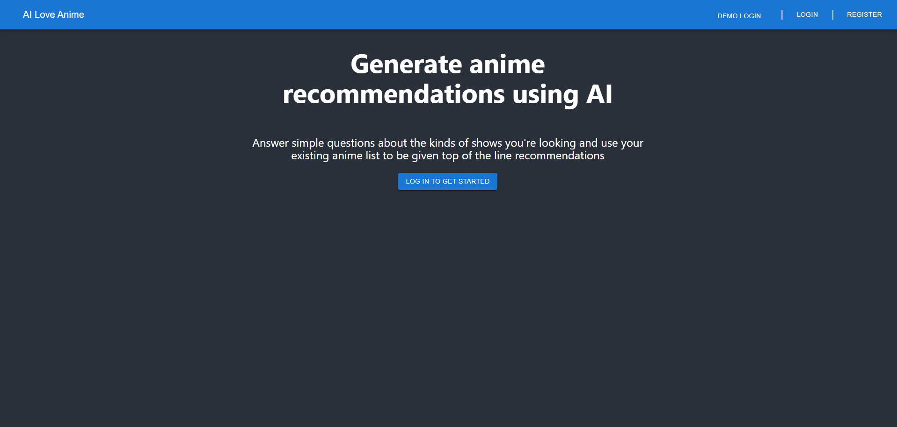
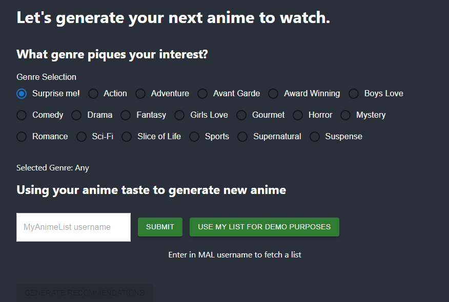
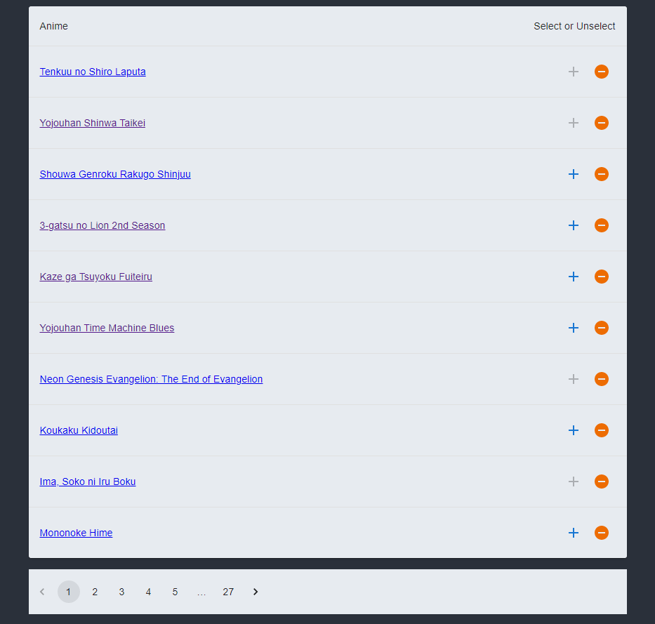
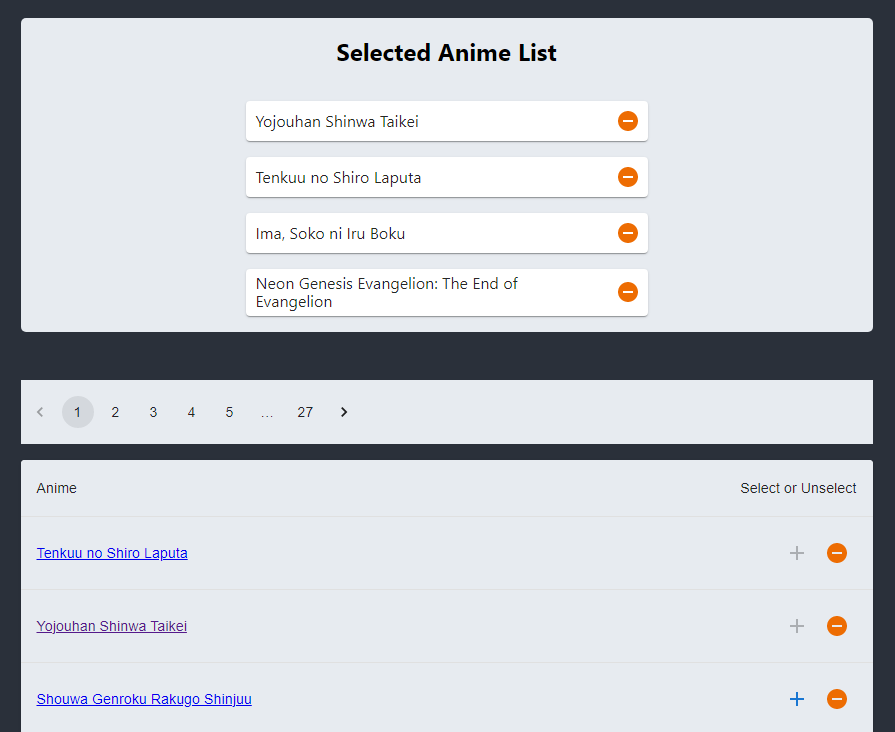
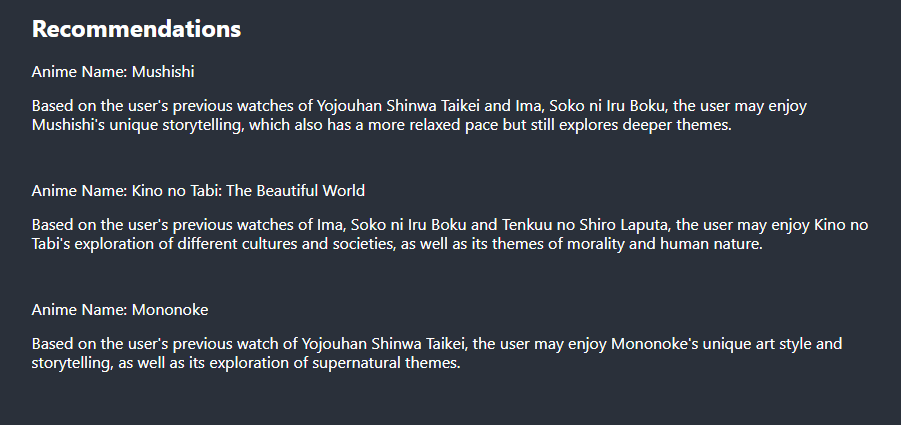

# Fullstack Project: AI Love Anime

[AI Love Anime](https://ai-love-anime.vercel.app/) is an anime recommendation site that provides AI-generated anime recommendations to users. With this app, users can get personalized anime recommendations based on their existing anime list and desired genre.




## Technologies and libraries used:s
- JavaScript
- React/Redux
- MongoDB
- NodeJS
- ExpressJS
- PassportJS
- OpenAI LLM
- Debugger
- Railway
- Vercel


## With Ai Love Anime, users can:

- #### Select Genre and Seen Anime



The anime in the user's list are sorted by the user's score given on myanimelist



Users (who are logged in) can receive recommendations based on their entered criteria. The user will receive the name of the anime and also a description of why the user would like the anime based on their genre chosen and anime already watched.


- #### See existing list of anime from myanimelist account



Users can only read their list and cannot change it. The list is arranged into a table by mapping the anime received from the myanimelist API. Clicking the buttons on the table row will either add the anime or remove the anime from the selected list used in recommendations.

```
    return currentAnime.map((row) => {
      const inList = _.find(selectedAnime, { malId: row.malId });

      return (
        <TableRow
          key={row.malId}
          sx={{ '&:last-child td, &:last-child th': { border: 0 } }}
        >
          <TableCell component="th" scope="row">
            <a href={`https://myanimelist.net/anime/${row.malId}`}>
              {row.title}
            </a>
          </TableCell>
          <TableCell align="right">
            <IconButton
              color="primary"
              aria-label="add to selected anime list"
              disabled={!!inList}
              onClick={() =>
                dispatch(addSelected({ malId: row.malId, title: row.title }))
              }
            >
              <AddIcon />
            </IconButton>
            <IconButton
              color="warning"
              aria-label="remove from selected anime list"
              onClick={() =>
                dispatch(removeSelected({ malId: row.malId, title: row.title }))
              }
            >
              <RemoveCircle />
            </IconButton>
          </TableCell>
        </TableRow>
      );
    });
```

Note that only 10 anime are shown from the list at a time and the user may paginate through the list using the number or arrow buttons around the table.

Pagination is handled through react state with the current page being saved to state.


- #### Sample recommendation output



## Future Features:
- Viewing recommendations given to other users
- Saving recommendations to be viewed later
- Search bar for anime
- Able to manually get anime without using a myanimelist account

## Sources:
- Anime information taken from myanimelist
- LLM used was from Open AI
